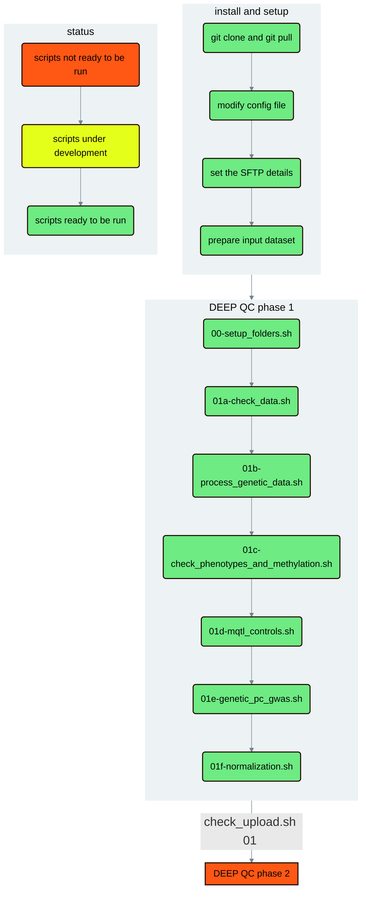

Below is a diagram of how the scripts fit together. 

```mermaid


flowchart TB
    %%{
  init: {
    'themeVariables': {
      'lineColor': '#738290'
            }
        }
    }%%

    %%Class style%%
    classDef ready-green fill:#6eeb83,stroke:#220901,stroke-width:2px,font-size:18px,color:#000
    classDef developing-yellow fill:#e4ff1a,stroke:#220901,stroke-width:2px,font-size:18px,color:#000
    classDef notready-red fill:#ff5714,stroke:#220901,stroke-width:2px,font-size:18px,color:#000
    classDef process-white fill:#edf2f4,stroke:#edf2f4,font-size:20px,color:#000
    classDef qtl-pink fill:#ffe9f3,stroke:#ffe9f3,stroke-width:4px,font-size:20px,color:#000
    classDef was-orange fill:#fed9b7,stroke:#fed9b7,stroke-width:4px,font-size:20px,color:#000

    %%sub modules%%
    subgraph setup["install and setup"]
        direction TB
        gitclone("git clone and git pull")
        config("modify config file")
        sftp("set the SFTP details")
        inputdata("prepare input dataset")
    end

    subgraph QC1["DEEP QC phase 1"]
        direction TB
        00("00-setup_folders.sh")
        01a("01a-check_data.sh")
        01b("01b-process_genetic_data.sh")
        01c("01c-check_phenotypes_and_methylation.sh")
        01d("01d-mqtl_controls.sh")
        01e("01e-genetic_pc_gwas.sh")
        01f("01f-normalization.sh")
    end

    subgraph status["status"]
        direction TB
        ready("scripts ready to be run")
        dev("scripts under development")
        notready("scripts not ready to be run")
    end

    subgraph QC2["DEEP QC phase 2"]
        direction TB
    end

    %%relationships%%
    gitclone --> config
    config -->  sftp
    sftp --> inputdata
    00 --> 01a
    01a --> 01b
    01b --> 01c
    01c --> 01d
    01d --> 01e
    01e --> 01f
    notready --> dev
    dev --> ready
    setup --> QC1
    QC1 -- <font size="5px">check_upload.sh 01 </font> --> QC2

    %%assign the style%%
    00:::ready-green
    01a:::ready-green
    01b:::ready-green
    01c:::ready-green
    01d:::ready-green
    01e:::ready-green
    01f:::ready-green
    gitclone:::ready-green
    config:::ready-green
    sftp:::ready-green
    inputdata:::ready-green
    ready:::ready-green
    dev:::developing-yellow
    notready:::notready-red
    setup:::process-white
    QC1:::process-white
    status:::process-white
    QC2:::notready-red

```